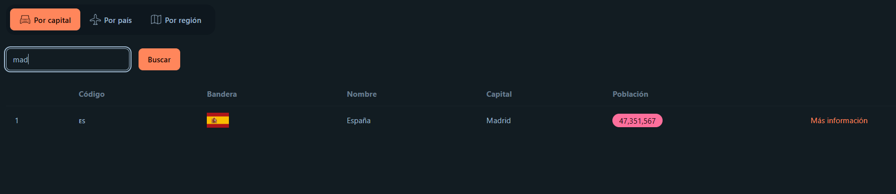
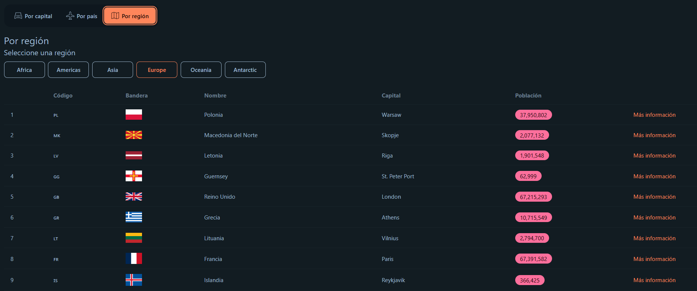
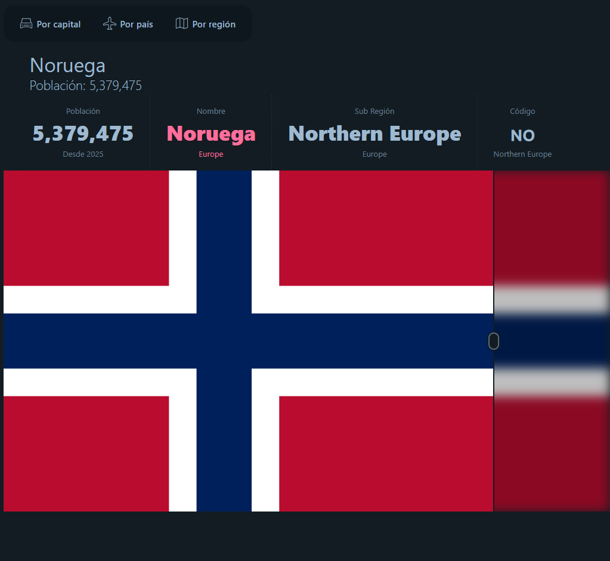
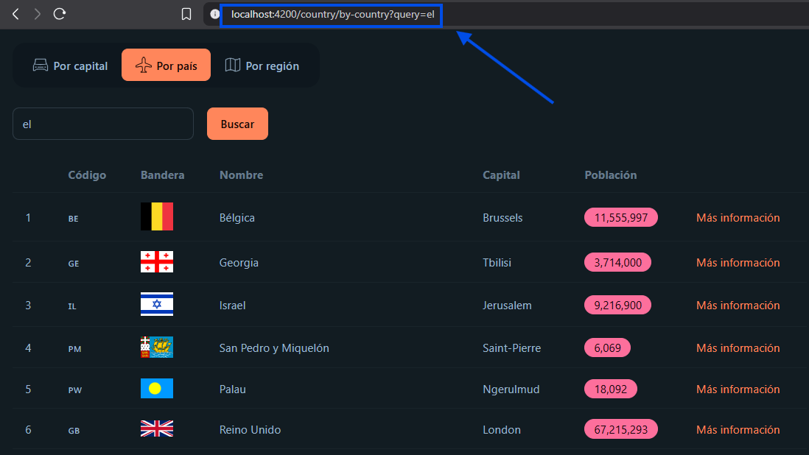

<div align="center">
  <br />
  <h1>🌍 Countries App</h1>
  <h3 align="center">Devtalles course - Learning/Practice project</h3>
    <a href="#" target="_blank">
      
    </a>
  <br />

  <div>
     
    
    
    
  </div>

   <div align="center">
     <h3>Search Countries easily by Capitals or Regions</h3>
    </div>
</div>

## 📝 <a name="table">Table of Contents</a>

1. 🤖 [**Introduction**](#introduction)
2. ⚙️ [**Tech Stack**](#tech-stack)
3. 🔋 [**Features**](#features)
4. ⚡ [**Quick Start**](#quick-start)

## <a name="introduction">🤖 Introduction</a>

<strong>Learning purposes Angular</strong> Project. The app's idea is to show a table of Countries, filtering them by Capital, just Country or Regions.

API used: Rest Countries https://restcountries.com/ 

Builded from Devtalles course where I learned the next lessons:


- **Child & Nested Routes**
- **Creation and Communication between Components**
- **TailwindCSS and DaisyUI**
- **Route file by feature/module**
- **Lazy loading of route modules**
- **Resources & rxResources**
- **Linked Signals**
- **Services**
- **Component reuse**
- **HTTP requests**
- **RXJS operators**
- **Cache**
- **Router**
- **QueryParameters**
- **Debounce**


## <a name="tech-stack">⚙️ Tech Stack</a>

- [**Angular 20**](https://angular.dev/)
- [**TypeScript**](https://www.typescriptlang.org/)
- [**TailwindCSS**](https://tailwindcss.com/)
- [**DaisyUI**](https://daisyui.com/docs/install/)

## <a name="features">🔋 Features</a>

- **Beauty and dynamic styles**: Not a website awards winner at all, but using TailwindCSS and DaisyUI for quickly setup a modern and consistent styles.

- **Search Countries and Search Countries by Capital**: Two different filters that allows the user Find Countries by their capital or just typing the Country. Showing some data as the country code, flag, name, capital, population and more data by clicking the Orange link in the right side

<br>
<div align="center">
  
</div>

<br>
<br>

- **Search Countries by Region**: The third filter allows the user Search Countries by the Region (for example Americas, Europe, Asia...)

<br>
<div align="center">
  
</div>
<br>
<br>

- **Country Details page**: Also there's a Country Detail component by clicking the orange button in the right side. Showing more data about the country and a big flag

<br>
<div align="center">
  
</div>
<br>

- **Different useful techniques**: For example using Query Params as we Navigate between pages, and saving via Cache the results. Allowing the user to share the URL to other users

<br>
<div align="center">
  
</div>
<br>


## <a name="quick-start">⚡ Quick Start</a>

### Prerequisites

Make sure you have the following installed on your machine:

- [**Git**](https://git-scm.com/)
- [**Node.js**](https://nodejs.org/en)
- [**npm**](https://www.npmjs.com/) (Node Package Manager)
- [**Angular CLI**](https://angular.dev/)

### Cloning the Repository

```bash
git clone https://github.com/Ivanlopez-dev/country-app.git
cd <your-project>
```

### Installation

Install the project dependencies using npm:

```bash
npm install
```

### Running the Project

```bash
ng serve -o
```

Open [**http://localhost:4200**](http://localhost:4200) in your browser to view the project.

